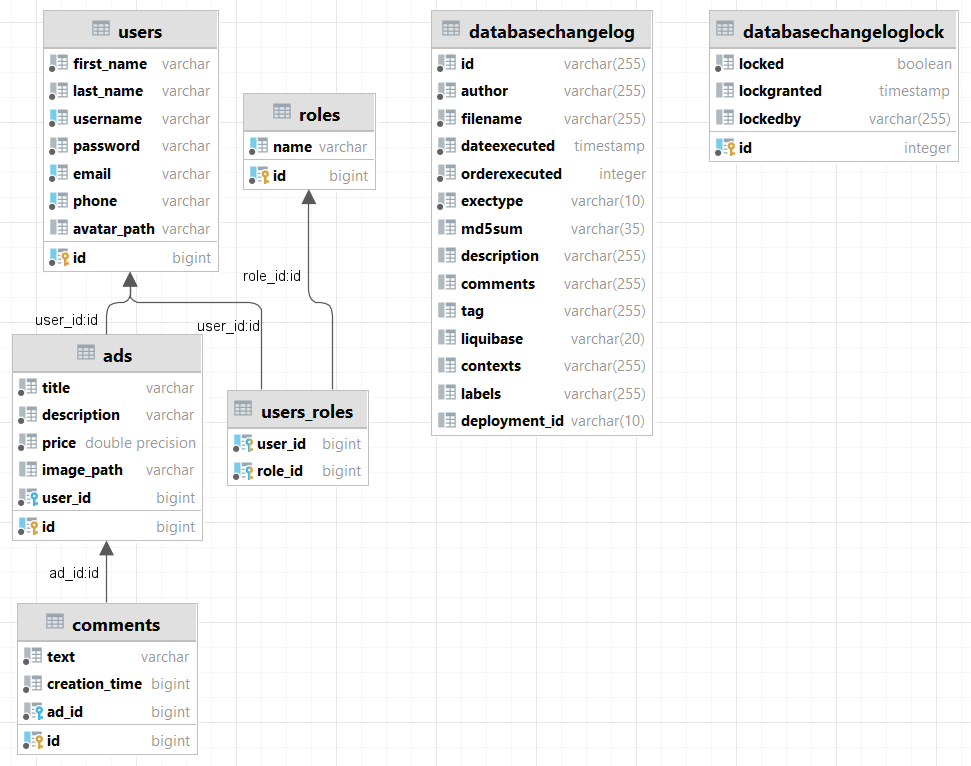

### **Маркетплейс**

Данный проект представляет собой площадку для покупки и продажи различных товаров.

_**Реализованный функционал:**_
- авторизация и аутентификация пользователей;
- распределение ролей между пользователями: пользователь и администратор;
- CRUD для объявлений на сайте: администратор может удалять или редактировать все объявления, а пользователи — только свои;
- под каждым объявлением пользователи могут оставлять отзывы;
- в заголовке сайта можно осуществлять поиск объявлений по названию;
- показывать и сохранять картинки объявлений.

_**Инструкция по запуску:**_
1. Запуск бэкенда через IDE:
- скачать проект из репозитория;
- загрузить все зависимотри;
- в файле application.properties нужно указать данные для работы с базой данных;
- запустить проект.
2. Запуск фронтэнда через Docker:
- откройте командную строку (cmd) и введите следующую команду:
docker run --rm -p 3000:3000 ghcr.io/bizinmitya/front-react-avito:v1.19
- после успешного запуска, сайт будет доступен по адресу localhost:3000.

**_Проект построен на базе Spring Boot и использует следующие технологии:_**
- Java 11
- Spring Core
- Spring Web MVC
- Spring Data JPA
- Spring Security
- Hibernate
- PostgreSQL
- Liquibase
- JUnit
- Mockito
- H2
- Jackson
- Slf4j
- Maven
- Docker
- Postman / Swagger

**_DB schema:_**

